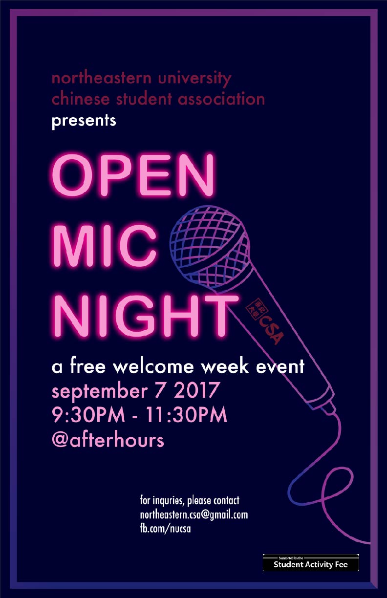
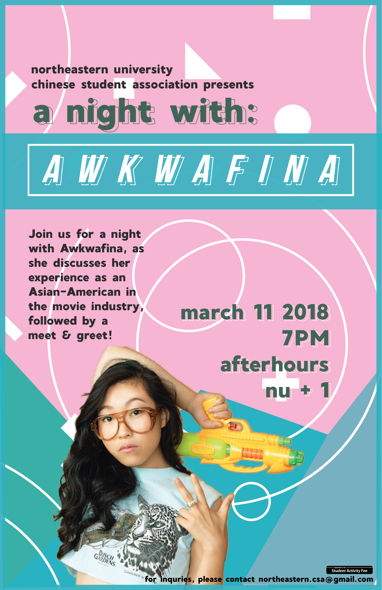
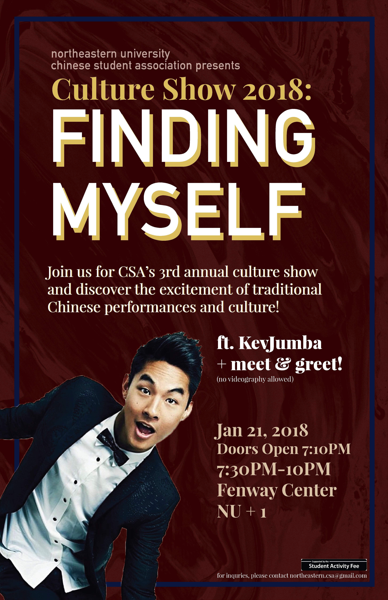

As an active member of the Asian-American community at Northeastern University, I always looked for ways to get involved. This desire manifested into the design work I've done over my past years at school.

During my 2nd year of college, I was Media & Design Specialist of the Chinese Student Association, which involved everything from creating marketing materials for events that hundreds of people attended, to designing apparel for the club to sell.

  
  
  

The Asian-American Center on campus also holds an annual Asian-American Heritage Month in which many speakers are invited to discuss a variety of topics. I was approached to design the branding and collateral for the entire event, and was given much freedom on design choices.

In addition to these two substantial positions, I've also had the opportunity to design one-off logos for programs within the Asian-American community. 

<!-- TO DO: add assets here-->

